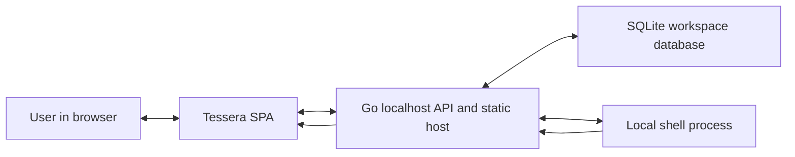

# Architecture Overview

Tessera is a local-first, text-first computer workspace. The MVP is one Go host process serving one browser SPA, one SQLite database, and local shell execution. A workspace contains panes. Each pane owns an editable worksheet buffer, a current working directory, and a transcript of commands and output that remains normal editable text.

Current baby-step prototype: the loaded SPA is intentionally a blank rectangle board. Users can draw rectangles with the mouse, move them, and resize them. Pane/workbook/shell concepts remain future direction until the rectangle workspace primitive feels right.

Constraints and assumptions:

- Target user: one local operator using Tessera as a durable command worksheet and pane workspace.
- First platform: local desktop browser talking to a Go process on localhost.
- Authentication: none for the MVP; bind to localhost by default.
- Persistence: SQLite file under local app data or an explicit `-db` path.
- Scope: editable panes, split layout, run selection/current line, stream output, save/load workspace.

## Project Structure

```text
tessera/
  cmd/tessera/
    main.go                 # process entrypoint, flags, server startup
  internal/app/
    app.go                  # dependency wiring and HTTP route registration
  internal/httpapi/
    workspace.go            # workspace load/save endpoints
    command.go              # command run and streaming endpoint
    static.go               # embedded SPA/static handler
  internal/store/
    store.go                # SQLite open, migration, shared helpers
    workspace.go            # workspace, pane, and buffer persistence
  internal/shell/
    runner.go               # per-pane shell command execution
    stream.go               # stdout/stderr event formatting
  web/
    index.html
    app.js                  # SPA bootstrap and event wiring
    api.js                  # fetch helpers and streaming reader
    state.js                # workspace state and save scheduling
    layout.js               # split pane rendering and focus tracking
    worksheet.js            # editable buffer behavior and run target selection
    styles.css
  migrations/
    001_init.sql            # SQLite schema
  README.md
  ARCHITECTURE.md
```

The MVP keeps code locality high by grouping behavior by concrete feature. There is no ORM, no generated client, no build step, and no plugin boundary.

## High-Level System Diagram



Data flow:

- The browser loads the SPA from the Go host.
- The SPA loads the active workspace with panes, buffer text, layout, and working directories.
- The user edits worksheet text directly in each pane.
- The user selects text or places the caret on a line and runs it.
- The SPA sends pane id, command text, working directory, and insertion point to the Go API.
- The Go host starts a local shell command, streams output events, and returns the final working directory when it can be determined.
- The SPA inserts command output inline below the command and saves the updated workspace.

## Technology Used

- Go: backend host, local HTTP API, command execution, static file serving.
- SQLite: durable workspace, panes, buffers, layout metadata, run history.
- Browser-native HTML/CSS/JavaScript: SPA UI without React, Vue, or bundling.
- Server-Sent Events or newline-delimited JSON: simple one-way command output streaming.
- PowerShell on Windows and `/bin/sh` on Unix-like systems: default local command shells.

## Core Components

### Frontend

Name: Tessera Workspace SPA

Description: A single-page workspace with editable worksheet panes. It supports pane focus, split panes, current line or selection execution, inline output insertion, per-pane working-directory display, and explicit or debounce-based save.

Technologies: HTML, CSS, browser JavaScript, `contenteditable` or `textarea` per pane for the MVP.

Deployment: Served by the local Go host from embedded static files or `web/` in development.

Frontend component structure:

- `app.js`: starts the app, loads the workspace, connects global keyboard shortcuts, and delegates rendering.
- `api.js`: wraps `GET /api/workspace/default`, `PUT /api/workspace/default`, and `POST /api/run`.
- `state.js`: owns the in-browser workspace object, active pane id, dirty flag, and debounced persistence.
- `layout.js`: renders the split tree from `layout_json`, supports split-left-right and split-top-bottom commands, and maps panes to worksheet elements.
- `worksheet.js`: owns editable buffer behavior, current line or selection extraction, output insertion, and caret restoration.
- `styles.css`: provides dense, utilitarian workspace styling with fixed toolbar heights and pane chrome.

### Backend Services

#### Tessera Host

Name: Tessera Host

Description: Serves the SPA, exposes workspace and command APIs, persists state to SQLite, and runs local shell commands for panes.

Technologies: Go standard library HTTP server, `database/sql`, SQLite driver, `os/exec`.

Deployment: Local executable.

#### Shell Runner

Name: Shell Runner

Description: Executes one command at a time per pane for the MVP. Streams stdout and stderr to the browser and reports process exit status. The runner receives a working directory from the pane state. Directory changes are tracked through a host-managed command wrapper where practical.

Technologies: Go `exec.CommandContext`, pipes, goroutines, process cancellation.

Deployment: In-process component inside Tessera Host.

API endpoints:

```text
GET /api/health
  Returns basic process status.

GET /api/workspace/default
  Loads the default workspace. Creates it on first run.

PUT /api/workspace/default
  Saves workspace layout, active pane, pane buffers, pane titles, pane positions, and pane cwd values.

POST /api/run
  Runs one command for one pane and streams newline-delimited JSON events in the response body.
```

`POST /api/run` request body:

```json
{
  "workspaceId": "default",
  "paneId": "pane-1",
  "command": "pwd",
  "cwd": "C:\\Users\\Administrator\\Repos\\tessera"
}
```

`POST /api/run` response events:

```json
{"type":"start","runId":"run-1","cwd":"C:\\Users\\Administrator\\Repos\\tessera"}
{"type":"stdout","text":"C:\\Users\\Administrator\\Repos\\tessera\r\n"}
{"type":"stderr","text":"warning text\r\n"}
{"type":"exit","code":0,"cwd":"C:\\Users\\Administrator\\Repos\\tessera"}
```

The first implementation should avoid separate pane mutation endpoints. The browser saves the whole workspace document after edits and split operations. This keeps persistence simple while the data model is still small.

## Data Stores

### SQLite Workspace Database

Name: Tessera SQLite Database

Type: SQLite

Purpose: Stores workspaces, pane buffers, pane layout, per-pane working directories, and command run records.

Key Schemas/Collections:

```sql
CREATE TABLE workspaces (
  id TEXT PRIMARY KEY,
  name TEXT NOT NULL,
  active_pane_id TEXT,
  layout_json TEXT NOT NULL DEFAULT '{}',
  created_at TEXT NOT NULL,
  updated_at TEXT NOT NULL
);

CREATE TABLE panes (
  id TEXT PRIMARY KEY,
  workspace_id TEXT NOT NULL REFERENCES workspaces(id) ON DELETE CASCADE,
  title TEXT NOT NULL DEFAULT 'Pane',
  buffer_text TEXT NOT NULL DEFAULT '',
  cwd TEXT NOT NULL DEFAULT '',
  position INTEGER NOT NULL DEFAULT 0,
  created_at TEXT NOT NULL,
  updated_at TEXT NOT NULL
);

CREATE TABLE command_runs (
  id TEXT PRIMARY KEY,
  workspace_id TEXT NOT NULL REFERENCES workspaces(id) ON DELETE CASCADE,
  pane_id TEXT NOT NULL REFERENCES panes(id) ON DELETE CASCADE,
  command_text TEXT NOT NULL,
  cwd_before TEXT NOT NULL,
  cwd_after TEXT NOT NULL DEFAULT '',
  exit_code INTEGER,
  started_at TEXT NOT NULL,
  finished_at TEXT
);
```

`layout_json` stores the split tree. For the MVP it can be a compact JSON object such as:

```json
{
  "direction": "row",
  "children": [
    { "paneId": "pane-1" },
    { "paneId": "pane-2" }
  ]
}
```

## External Integrations / APIs

Service Name 1: Local Operating System Shell

Purpose: Runs commands selected by the user in worksheet panes.

Integration Method: Go process execution with stdout and stderr pipes.

## Deployment & Infrastructure

Cloud Provider: N/A. Tessera MVP is local-only.

Key Services Used: N/A.

CI/CD Pipeline: N/A for the initial MVP. Add GitHub Actions only after the first executable MVP exists.

Monitoring & Logging: Go standard logger to stderr. Command output belongs in the worksheet transcript, not in application logs, unless debugging is enabled.

## Security Considerations

Authentication: None for MVP. The server must bind to `127.0.0.1` by default.

Authorization: N/A for single-user local operation.

Data Encryption: N/A for MVP. SQLite remains a local unencrypted file.

Key Security Tools/Practices:

- Treat command execution as intentionally powerful and local-only.
- Never listen on public interfaces unless the user explicitly opts in.
- Include request cancellation so the user can stop long-running commands.
- Avoid passing commands through nested quoting when possible.
- Show the working directory clearly before command execution.

## Development & Testing Environment

Local Setup Instructions:

```powershell
go mod init tessera
go run ./cmd/tessera
```

Testing Frameworks:

- Go `testing` package for store and shell wrapper behavior.
- Manual browser smoke test for split panes, command streaming, save, and reload.

Code Quality Tools:

- `gofmt` for Go files.
- No frontend build tooling in the MVP.

## Future Considerations / Roadmap

- First implementation step 1: create `go.mod`, `cmd/tessera/main.go`, app wiring, static file serving, and `GET /api/health`.
- First implementation step 2: add SQLite store open and migration, then implement default workspace load/save.
- First implementation step 3: build the vanilla SPA shell with toolbar, two-pane-capable layout renderer, editable worksheet panes, focus tracking, and debounced save.
- First implementation step 4: implement `POST /api/run` as an NDJSON streaming response from a shell command.
- First implementation step 5: insert streamed output inline below the command and update the pane cwd on final exit.
- First implementation step 6: add focused Go tests for store migrations/load/save and a shell runner test using a harmless command.
- Add command cancellation endpoint after basic streaming works.
- Replace simple pane layout with resizable split handles.
- Add named workspaces and workspace picker.
- Add durable run metadata views only if transcripts alone are insufficient.
- Add file path affordances such as open file, reveal path, or paste path.
- Add search across worksheet buffers.
- Add optional terminal-like process sessions only after stateless command execution proves limiting.

Avoid for MVP:

- IDE project model.
- Language server integration.
- Remote multi-user synchronization.
- Plugin system.
- Containers or orchestration.
- Complex terminal emulation.

## Glossary / Acronyms

SPA: Single Page Application.

Pane: A visible workspace region containing one editable worksheet buffer.

Worksheet: Editable text containing notes, commands, paths, and command output together.

Buffer: The persisted text content of a worksheet pane.

Run Current Line/Selection: Execute selected text when present, otherwise execute the line containing the caret.

CWD: Current working directory used when executing commands for a pane.

Transcript: Command and output text preserved inline in the worksheet buffer.
