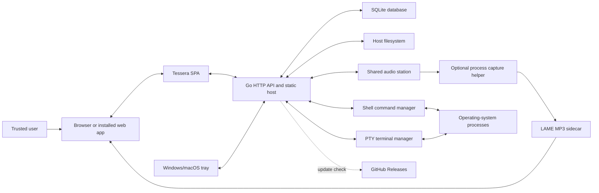

# Architecture Overview

Tessera is a local-first, text-first computer workspace. One Go process serves
an embedded browser SPA, persists workspace state in SQLite, manages local
commands and PTY terminals, and exposes host filesystem operations. Users work
inside movable, resizable panes organized into named desktop sessions.

The architecture deliberately favors a single deployable process and direct
code paths over distributed services or framework-heavy abstractions.

Constraints and assumptions:

- Target users are one operator or a small trusted group controlling a local
  machine or trusted LAN host.
- Tessera currently has no authentication and no robust authorization.
- The `-users` roster separates state but is not an identity or access-control
  system.
- Network access is trusted access: API clients can execute commands and
  access files with the Tessera process's operating-system permissions.
- The listener defaults to `127.0.0.1`; LAN binding is explicit.
- SQLite is the durable application store. Host files remain ordinary files
  outside the database.
- The frontend is a browser SPA; Windows and macOS additionally support native
  tray controls.

## Project Structure

```text
tessera/
  cmd/tessera/
    main.go                    # flags, process lifecycle, tray and update restart
  internal/app/
    app.go                     # dependency wiring and HTTP handler construction
  internal/server/
    server.go                  # store/managers/listener startup and shutdown
  internal/desktop/
    controller.go              # start, stop, and configure lifecycle
    tray*.go                   # Windows/macOS tray; server-only platform stub
    open_*.go                  # platform default-browser integration
  internal/httpapi/
    api.go                     # route registration and shared JSON responses
    workspace.go               # workspace document API
    sessions.go                # roster, named sessions, and user settings
    command.go                 # command start and NDJSON streaming
    terminal.go                # terminal WebSocket transport
    directories.go             # directory browser data
    files.go                   # file read/write
    file_operations.go         # copy, move, and delete
    background.go              # workspace background image API
    update.go                  # self-update API
    audio.go                   # shared audio state, SSE, ranges and URL proxy
    security.go                # origins, proxy trust, headers, limits and audit
    static.go                  # embedded SPA and history fallback
  internal/store/
    store.go                   # SQLite open and embedded migration runner
    workspace.go               # workspaces, panes, and command-run persistence
    session.go                 # session CRUD and per-user settings
    workspace_background.go    # image BLOB persistence
    audit.go                   # redacted HTTP security-event persistence
  internal/runs/
    manager.go                 # command lifecycle, transcript updates, subscribers
  internal/shell/
    runner.go                  # platform shell execution and cwd tracking
    proc_*.go                  # platform process behavior
  internal/terminal/
    manager.go                 # session ownership, replay, and teardown
    session*.go                # ConPTY and Unix PTY implementations
  internal/audio/
    manager.go                 # shared station and capture/encode fan-out
  internal/update/
    update.go                  # GitHub release check, binary swap, restart request
  internal/version/
    version.go                 # build-time version value
  web/
    app.js                     # SPA state, pane UI, interactions, and API calls
    styles.css                 # workspace, pane, modal, Deskbar, and theme styling
    index.html                 # application shell and bundled module loading
    embed.go                   # go:embed filesystem
    codemirror-entry.js        # editor bundle entry point
    terminal-entry.js          # terminal bundle entry point
    text-editor-language.mjs   # file-extension language selection
    vendor/                    # committed esbuild output
    assets/                    # fonts, application icons, and pane icons
  migrations/
    embed.go                   # embeds the ordered SQL sequence
    001_*.sql ... 026_*.sql    # append-only application schema migrations
  tasks/                       # small implementation task records
  .github/workflows/
    release.yml                # tested multi-platform tagged releases
```

The Go backend is separated by concrete responsibility. The frontend currently
keeps most application behavior in `web/app.js`; this preserves directness but
is the main modularization pressure point as features grow.

## High-Level System Diagram



Primary data flows:

1. The browser loads the embedded SPA and selects a configured user and named
   session.
2. The SPA loads the workspace document and renders its panes.
3. Client-side edits and geometry changes are debounced into whole-workspace
   saves. The server preserves buffers owned by active command runs to prevent
   stale client saves from overwriting streamed transcript output.
4. Worksheet commands are sent to the run manager. Output is streamed as NDJSON,
   persisted into the pane transcript, and available for subscriber reattachment.
5. Terminal panes attach through WebSocket to session-scoped PTY processes.
6. File Browser and Text Editor panes call filesystem APIs using host paths.
7. Destroying a named session stops that session's commands and terminals before
   deleting its persisted workspace.
8. Every Audio pane subscribes to one host-wide station over SSE. File streams
   use HTTP ranges, URL streams are proxied per listener, and one Terminal
   helper/encoder pipeline fans MP3 out through bounded listener queues.

## Technology Used

- **Go 1.26:** executable entry point, HTTP server, lifecycle management,
  concurrency, shell execution, terminal sessions, and updater.
- **`net/http`:** API routing and embedded static-file delivery.
- **SQLite via `modernc.org/sqlite`:** embedded durable state without a separate
  database service.
- **Gorilla WebSocket:** bidirectional terminal transport.
- **ConPTY and `creack/pty`:** Windows and Unix-like terminal processes.
- **Vanilla HTML, CSS, and JavaScript:** SPA implementation without a component
  framework.
- **CodeMirror 6:** worksheet and text-editor surfaces.
- **ghostty-web:** browser terminal renderer.
- **esbuild:** produces committed CodeMirror and terminal bundles.
- **getlantern/systray:** Windows and macOS notification-area controls. Linux
  releases exclude the tray implementation and remain CGO-free.
- **GitHub Actions and GitHub Releases:** tagged builds, release assets, and the
  self-update source.

## Core Components

### Frontend

Name: Tessera Workspace SPA

Description: The browser UI owns workspace interaction, client-side pane state,
session routing, modal and command-palette behavior, debounced persistence, and
rendering for all pane types.

Technologies: Browser JavaScript, HTML, CSS, CodeMirror 6, ghostty-web, WebSocket,
Fetch API, and browser history/storage APIs.

Deployment: Embedded in the Go binary from `web/`; `-web <directory>` serves
working assets from disk during development. The manifest supports home-screen
installation on compatible browsers.

Current pane types:

- **Worksheet:** editable command-and-output transcript with selection/current
  line execution and free/normal cursor modes.
- **Terminal:** live PTY terminal with resize, font controls, scrollback replay,
  and session-scoped lifecycle.
- **Text Editor:** tabbed host-file editor with save/save-as and syntax
  highlighting selected by file extension.
- **File Browser:** directory navigation and file copy, move, delete, paste, and
  supported-text-file open behavior.
- **Audio:** controls and listens to one host-wide source. Global transport state
  is synchronized by SSE while volume, mute, and autoplay recovery are local to
  each browser.

The SPA also implements overlapping window geometry, active-pane and z-order
state, minimize/maximize/dock/restore behavior, the Deskbar, command palette,
settings, themes, background images, user selection, named-session management,
route/history synchronization, and client/server connection recovery. A
low-frequency health monitor opens one recovery dialog after consecutive
failures; restored connections reload only after user confirmation, except an
explicit Reconnect action which verifies health and then reloads.

### Backend Services

#### Tessera Host

Name: Tessera Host

Description: Starts storage and process managers, registers the HTTP API, serves
the SPA, listens on the configured address, and coordinates graceful shutdown.

Technologies: Go, `net/http`, `database/sql`, embedded filesystems.

Deployment: One local executable. The default database lives under the user's
configuration directory unless `-db` overrides it.

#### Workspace and Session API

Name: Workspace and Session API

Description: Loads and saves complete workspace documents; manages configured
users, named sessions, active-session timestamps, per-user settings, and
session-scoped teardown.

Technologies: Go HTTP handlers and SQLite transactions.

Deployment: In-process inside the Tessera Host.

Important route groups:

```text
GET  /api/health
GET  /api/users
GET/POST/PATCH/DELETE /api/users/{user}/sessions/...
GET/PUT /api/users/{user}/settings
GET/PUT /api/workspace/{session}
GET/PUT/DELETE /api/workspace/{session}/background
GET /api/files/download?path=...
POST /api/files/upload?directory=...&name=...&overwrite=0|1
GET /api/audio/state
PUT /api/audio/source
POST /api/audio/control
GET /api/audio/events
GET/HEAD /api/audio/stream?sourceVersion=N
```

#### Command Run Manager

Name: Command Run Manager

Description: Runs worksheet commands, streams stdout/stderr, tracks working
directory changes, persists run metadata, inserts transcript output, supports
subscriber reattachment, and stops commands by session.

Technologies: Go goroutines, `os/exec`, PowerShell on Windows, `/bin/sh` on
Unix-like systems, NDJSON streaming.

Deployment: In-process inside the Tessera Host.

#### Terminal Manager

Name: Terminal Manager

Description: Owns PTY sessions keyed by workspace and pane, replays bounded
scrollback to reconnecting clients, broadcasts output, resizes terminals, and
terminates sessions during pane, workspace, or server teardown.

Technologies: ConPTY, Unix PTYs, Gorilla WebSocket.

Deployment: In-process inside the Tessera Host.

#### Shared Audio Manager

Name: Host-wide Audio Station

Description: Persists one selected file, URL, or Terminal source; resolves
latest-command-wins transport state; emits complete SSE snapshots; invalidates
stale source versions; and supervises one process-capture-to-MP3 pipeline.

Terminal capture starts an external `tessera-audio-capture` helper against the
selected PTY shell PID and its descendants. The helper normalizes output to 48
kHz stereo s16le PCM. Tessera waits ten seconds for its NDJSON `ready` event,
pipes PCM into the pinned 192 kbps LAME sidecar, and disconnects slow listeners
whose bounded queues fill. Cancellation requests graceful termination and
force-kills remaining processes after two seconds. Helper/encoder failure pauses
the station, closes listeners, and remains isolated from file/URL playback.

Deployment: The manager is in-process. LAME is a release companion installed by
the updater. Platform capture helpers are optional, separately installed
executables because they carry OS-specific APIs and permissions.

#### Filesystem API

Name: Filesystem API

Description: Lists directories, reads and writes files, and performs copy,
move, and delete operations using absolute host paths.

Technologies: Go `os`, `io`, and `path/filepath` packages.

Deployment: In-process and operating with the Tessera process's filesystem
permissions. There is currently no configured root-directory sandbox.

#### Desktop Controller

Name: Desktop Controller

Description: Starts and stops the local server and opens its URL in the default
browser. Windows and macOS builds expose these actions through a tray menu;
Linux uses the server lifecycle without a tray.

Technologies: Go platform files and getlantern/systray on supported platforms.

Deployment: Compiled into the main executable.

File Browser transfers use streamed request/response bodies. Uploads are
bounded by `-max-upload-size`, staged beside the destination, and moved into
place only after the complete body is accepted. Downloads use `ServeContent`
for attachment metadata and byte-range support.

#### Self-Updater

Name: GitHub Release Updater

Description: Checks the latest release, selects exact Tessera and LAME
OS/architecture assets, stops live capture, installs both transactionally with
rollback, requests shutdown, and launches the replacement. It can bootstrap a
missing exact-version LAME companion after an upgrade from a legacy updater.

Technologies: GitHub Releases REST API and Go HTTP/file APIs.

Deployment: In-process. It currently assumes anonymous access to release
metadata and assets.

## Data Stores

### SQLite Application Database

Name: Tessera SQLite Database

Type: SQLite file

Purpose: Durable storage for users' sessions, pane state, settings, backgrounds,
and command-run metadata.

Key Schemas/Collections:

- `workspaces`: named sessions, owner, active pane, layout, theme/background
  metadata, and last-opened timestamps.
- `panes`: pane kind, buffer, editor state, paths, geometry, z-order, fullscreen,
  minimized state, and font settings.
- `command_runs`: command text, before/after working directories, status, exit
  code, and timestamps.
- `workspace_backgrounds`: background image MIME type and BLOB data.
- `user_settings`: default theme and font settings shared across a user's
  sessions.
- `audio_station`: host-wide selected source, paused file position, and monotonic
  source/state versions. Playing state is deliberately not restored.
- `audit_events`: optional, bounded-retention request metadata for
  state-changing API requests and Terminal connection attempts. Persistence is
  disabled by default. Records exclude query strings, bodies, command text,
  file contents, cookies, and tokens.

Numbered files under `migrations/` are the single source of truth for the
application schema and are embedded into the executable. `internal/store/store.go`
validates a contiguous sequence, applies each pending migration transactionally,
and records progress with SQLite `PRAGMA user_version`. Historical one-column
`ALTER TABLE` migrations allow pre-versioned Tessera databases to adopt columns
they already contain without duplicating schema definitions in Go.

### Host Filesystem

Name: Host Filesystem

Type: Operating-system files and directories

Purpose: User content opened by Text Editor and File Browser panes, executable
replacement files used by the updater, and the SQLite database itself.

Key Schemas/Collections: N/A. Paths are ordinary host paths and are not imported
into an application-owned storage hierarchy.

## External Integrations / APIs

- **Local operating-system shell:** executes worksheet commands through
  PowerShell or `/bin/sh`.
- **Local PTY facilities:** provides interactive terminal processes through
  ConPTY or Unix PTYs.
- **Host filesystem:** supplies file navigation and mutation capabilities.
- **Default browser and desktop tray:** opens/configures the local service and
  controls its lifecycle on desktop platforms.
- **GitHub Releases API:** supplies version metadata and release binaries for
  self-update. No GitHub token is currently configured.
- **Audio capture helper:** optional per-platform executable using Windows
  process loopback, PipeWire process routing, or ScreenCaptureKit. It receives a
  PTY root PID and returns normalized PCM under a small stdout/stderr protocol.

## Deployment & Infrastructure

Cloud Provider: N/A. Tessera is a local executable and does not require hosted
application infrastructure.

Key Services Used: A local TCP listener, a local SQLite file, host processes,
and optional GitHub Releases access.

CI/CD Pipeline: `.github/workflows/release.yml` runs on `v*` tags. It builds and
tests the Tessera platform matrix, builds pinned LAME 3.100 companions for
Windows amd64, Linux amd64, and both macOS architectures, and publishes the LAME
license plus corresponding source archive. Optional native capture helpers are
installed and versioned independently from automatic updates.

Monitoring & Logging: Go standard logging writes lifecycle and failure messages
to stderr or the platform process output. When explicitly enabled, SQLite
stores redacted audit metadata for mutations and Terminal connection attempts
with configurable retention.
The HTTP security middleware writes one stdout connection line per distinct
resolved-IP/User-Agent identity. It exposes the IP and a short process-salted
fingerprint, not the User-Agent or request data.
Command output belongs to worksheet transcripts or terminal streams. There is
no centralized telemetry service.

## Security Considerations

Authentication: None. Browser-stored user selection and the configured roster
are convenience mechanisms, not proof of identity.

Authorization: No robust authorization exists yet. User and session ownership
checks prevent accidental cross-session routing within the configured model,
but any client that can reach the service can select a configured user and call
powerful APIs.

Data Encryption: SQLite and workspace background BLOBs are not encrypted by
Tessera. Local HTTP is plaintext. Operating-system storage controls and network
isolation provide the current protection boundary.

Key Security Tools/Practices:

- Bind to `127.0.0.1` by default.
- Treat `0.0.0.0` or any non-loopback binding as trusted-network-only.
- Do not expose Tessera directly to the public internet.
- Require exact same-origin browser mutations and Terminal WebSocket
  handshakes while retaining origin-less access for local non-browser clients.
- Ignore forwarding headers unless the immediate peer matches an explicitly
  configured exact IP or CIDR; reject ambiguous or multi-hop forwarded values.
- Apply CSP, frame blocking, MIME sniffing protection, referrer and permissions
  policies, and HTTPS-only HSTS.
- Rate-limit API requests per derived client IP with bounded in-memory state.
- Optionally persist redacted security audit events with bounded retention;
  persistence is disabled by default.
- Treat API reachability as permission to execute commands and access host files
  with the Tessera process's privileges.
- Treat audio URL proxying, host-path selection, Terminal PID selection, and
  shared transport control as equally trusted capabilities. URL proxying can
  reach network resources visible to the host.
- Reject cross-origin terminal WebSocket connections. This is defense in depth,
  not authentication.
- Scope process teardown by workspace so deleting one session does not terminate
  another session's work.
- Avoid running Tessera with operating-system privileges it does not need.

Planned security direction:

1. Introduce real user authentication with secure server-side sessions or
   equivalent short-lived credentials.
2. Add robust authorization checks to every workspace, session, settings,
   filesystem, command, terminal, update, and administrative operation.
3. Define explicit roles/capabilities and ownership rules instead of inferring
   access from a client-supplied user or session identifier.
4. Bind the existing origin checks to authenticated sessions with CSRF tokens
   for state-changing requests.
5. Add configurable filesystem roots and command-execution policies for
   deployments that should not expose the entire host account.
6. Support TLS through native configuration or a documented trusted reverse
   proxy deployment.
7. Record security-relevant actions in an audit log without copying sensitive
   command output unnecessarily.

## Development & Testing Environment

Local Setup Instructions:

```powershell
go run ./cmd/tessera
go run ./cmd/tessera -web .\web
npm install
npm run build:web
```

Testing Frameworks:

- Go `testing` for storage, migrations, sessions, API routing, filesystem
  operations, command streaming, terminals, desktop lifecycle, and updater
  behavior.
- Node's built-in test runner for isolated frontend language-selection logic.
- Manual or controlled-browser smoke tests for interaction-heavy workspace
  behavior.

Code Quality Tools:

```powershell
gofmt -w <changed-go-files>
go test ./...
go vet ./...
node --check web/app.js
node --test web/text-editor-language.test.mjs
node --test web/server-connection.test.mjs
```

The release workflow also rebuilds committed frontend bundles with esbuild and
runs the Go test suite on every target runner.

## Future Considerations / Roadmap

- Implement the authentication and robust authorization plan described above
  before treating Tessera as safe for untrusted or public network access.
- Split `web/app.js` into direct feature modules for API/persistence, workspace
  interaction, pane kinds, and overlays as frontend behavior continues to grow.
- Add focused browser automation for session routing, persistence, pane
  geometry, fullscreen, Deskbar, terminal attachment, and file-editor flows.
- Keep applied migration files immutable and append a new numbered SQL file for
  every future schema change; extend migration tests with each persisted field.
- Package and sign macOS releases as `.app` bundles; consider platform-native
  installation and update verification on all desktop targets.
- Add release checksums or signatures and authenticated GitHub access if private
  releases must be supported.
- Keep remote synchronization, plugins, containers, and IDE-scale project models
  out of scope until the local workspace and security boundaries are stable.

## Glossary / Acronyms

- **API:** Application Programming Interface exposed by the local Go host.
- **CGO:** Go interoperability with C; required by the current macOS tray build.
- **CWD:** Current working directory used by a pane's command or terminal.
- **NDJSON:** Newline-delimited JSON used to stream command events.
- **Pane:** A movable workspace window containing a worksheet, terminal, text
  editor, file browser, or shared audio controls.
- **PTY:** Pseudo-terminal backing an interactive terminal pane.
- **Session:** A named, persisted desktop owned by one configured user entry.
- **SPA:** Single-page application served by the Tessera host.
- **Transcript:** Editable worksheet text containing commands and inserted output.
- **Trusted environment:** A host and network where every client able to reach
  Tessera is allowed to exercise Tessera's command and filesystem capabilities.
