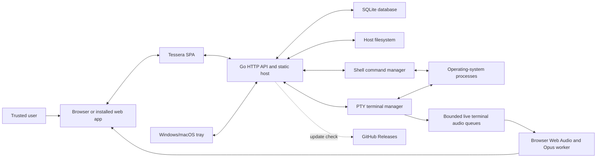

# Architecture Overview

Tessera is a local-first, text-first computer workspace. One Go process serves
an embedded browser SPA, persists workspace state in SQLite, manages local
commands and PTY terminals, and exposes host filesystem operations. Users work
inside movable, resizable panes organized into named desktop sessions.

The architecture deliberately favors a single deployable process and direct
code paths over distributed services or framework-heavy abstractions.

Constraints and assumptions:

- Target users are one operator or a small trusted group controlling a local
  machine or trusted LAN host.
- Tessera currently has no authentication and no robust authorization.
- The `-users` roster separates state but is not an identity or access-control
  system.
- Network access is trusted access: API clients can execute commands and
  access files with the Tessera process's operating-system permissions.
- The listener defaults to `127.0.0.1`; LAN binding is explicit.
- SQLite is the durable application store. Host files remain ordinary files
  outside the database.
- The frontend is a browser SPA; Windows and macOS additionally support native
  tray controls.

## Project Structure

```text
tessera/
  cmd/tessera/
    main.go                    # flags, process lifecycle, tray and update restart
  cmd/tessera-audio/
    main.go                    # clip/query helper and FFmpeg Opus stream producer
  internal/app/
    app.go                     # dependency wiring and HTTP handler construction
  internal/server/
    server.go                  # store/managers/listener startup and shutdown
  internal/desktop/
    controller.go              # start, stop, and configure lifecycle
    tray*.go                   # Windows/macOS tray; server-only platform stub
    open_*.go                  # platform default-browser integration
  internal/httpapi/
    api.go                     # route registration and shared JSON responses
    workspace.go               # workspace document API
    sessions.go                # roster, named sessions, and user settings
    shortcuts.go               # per-user launcher API and host command expansion
    terminal.go                # terminal WebSocket transport
    directories.go             # directory browser data
    background.go              # workspace background image API
    update.go                  # self-update API
    security.go                # origins, proxy trust, headers, limits and audit
    static.go                  # embedded SPA and history fallback
  internal/store/
    store.go                   # SQLite open and embedded migration runner
    workspace.go               # workspaces, panes, and archived document persistence
    session.go                 # session CRUD and per-user settings
    shortcuts.go               # independent per-user shortcut revisions
    workspace_background.go    # image BLOB persistence
    audit.go                   # redacted HTTP security-event persistence
  internal/terminal/
    manager.go                 # session ownership, replay, and teardown
    audio.go                   # bounded per-listener live audio delivery
    session*.go                # ConPTY and Unix PTY implementations
  internal/shortcuts/
    shortcuts.go               # definition validation and literal shell arguments
  internal/terminalaudio/
    protocol.go, stream.go      # private clip and Opus streaming OSC protocol
    filter.go                  # stream ingress filtering before retained output
  internal/update/
    update.go                  # GitHub release check, binary swap, restart request
  internal/version/
    version.go                 # build-time version value
  web/
    app.js                     # SPA state, pane UI, interactions, and API calls
    shortcuts.mjs              # shortcut manager and invocation modal
    styles.css                 # workspace, pane, modal, Deskbar, and theme styling
    index.html                 # application shell and bundled module loading
    embed.go                   # go:embed filesystem
    terminal-entry.js          # terminal bundle entry point
    terminal-audio*.mjs         # Web Audio playback and bounded Opus decoding
    terminal-opus-entry.js      # bundled decoder worker entry point
    vendor/                    # committed esbuild output
    assets/                    # fonts, application icons, and pane icons
  migrations/
    embed.go                   # embeds the ordered SQL sequence
    001_*.sql ... 047_*.sql     # append-only application schema migrations
  tasks/                       # small implementation task records
  .github/workflows/
    release.yml                # platform CI and tagged server/helper releases
```

The Go backend is separated by concrete responsibility. The frontend currently
keeps most application behavior in `web/app.js`; this preserves directness but
is the main modularization pressure point as features grow.

## High-Level System Diagram


```mermaid
flowchart LR
  USER["Trusted user"] --> BROWSER["Browser or installed web app"]
  BROWSER <--> SPA["Tessera SPA"]
  SPA <--> API["Go HTTP API and static host"]
  API <--> DB["SQLite database"]
  API <--> FS["Host filesystem"]
  API <--> RUNS["Shell command manager"]
  API <--> PTY["PTY terminal manager"]
  RUNS <--> OS["Operating-system processes"]
  PTY <--> OS
  PTY --> EFFECTS["Bounded live terminal audio queues"]
  EFFECTS --> PLAYBACK["Browser Web Audio and Opus worker"]
  PLAYBACK --> BROWSER
  API -. update check .-> GH["GitHub Releases"]
  TRAY["Windows/macOS tray"] <--> API
```

Primary data flows:

1. The browser loads the embedded SPA and selects a configured user and named
   session.
2. The SPA loads the workspace document and renders its panes.
3. Client-side edits and geometry changes are debounced into whole-workspace
   saves. Each document carries an opaque revision, and SQLite conditionally
   replaces it only when the submitted revision is current. A reconnecting
   browser revalidates before resuming autosave; conflicts pause saving until
   the latest document is reloaded. Retired pane documents remain opaque archive
   fields and survive ordinary layout saves.
4. Terminal panes attach through WebSocket to session-scoped PTY processes.
   Native OSC audio requests use a separate bounded live queue on that socket,
   independent of paused text/replay. A host ingress filter removes streaming
   OSC before native parsing, snapshots, and retained output. Only live decoder
   setup is retained for joining listeners. Browser Web Audio mixes embedded
   clips and incrementally decoded Opus streams with local activation and
   per-terminal mute. See [terminal audio](docs/terminal-audio.md).
5. Terminal file requests use scoped tickets to stream host-local file contents
   over HTTP after an explicit browser claim.
6. Destroying a named session stops that session's terminals before
   deleting its persisted workspace.
## Technology Used

- **Go 1.26:** executable entry point, HTTP server, lifecycle management,
  concurrency, shell execution, terminal sessions, and updater.
- **`net/http`:** API routing and embedded static-file delivery.
- **SQLite via `modernc.org/sqlite`:** embedded durable state without a separate
  database service.
- **Gorilla WebSocket:** bidirectional terminal transport.
- **ConPTY and `creack/pty`:** Windows and Unix-like terminal processes.
- **Vanilla HTML, CSS, and JavaScript:** SPA implementation without a component
  framework.
- **ghostty-web:** browser terminal renderer.
- **esbuild:** produces committed terminal, audio-decoder and VNC bundles.
- **getlantern/systray:** Windows and macOS notification-area controls. Linux
  releases exclude the tray implementation and remain CGO-free.
- **GitHub Actions and GitHub Releases:** tagged builds, release assets, and the
  self-update source.

## Core Components

### Frontend

Name: Tessera Workspace SPA

Description: The browser UI owns workspace interaction, client-side pane state,
session routing, modal and command-palette behavior, debounced persistence, and
rendering for all pane types.

Technologies: Browser JavaScript, HTML, CSS, ghostty-web, WebSocket,
Fetch API, and browser history/storage APIs.

Deployment: Embedded in the Go binary from `web/`; `-web <directory>` serves
working assets from disk during development. The manifest supports home-screen
installation on compatible browsers.

Current pane types:

- **Terminal:** live PTY terminal with resize, font controls, scrollback replay,
  and session-scoped lifecycle.
- **Browser:** sandboxed loopback development-server view using an ephemeral,
  capability-addressed path proxy on Tessera's existing listener. The proxy
  rewrites common root-relative HTTP and WebSocket traffic and strips Tessera
  cookies before forwarding. A client-only help dialog is shared by the Browser
  toolbar's network icon and the command palette; it validates and launches a
  loopback address without adding discovery or port-scanning APIs.
- **VNC:** manually connected noVNC remote-desktop view. A five-minute,
  single-use capability authorizes one same-origin binary WebSocket, which the
  Go host bridges to the requested TCP target. Targets and view preferences are
  durable; credentials and server-verification decisions exist only in the
  browser page.
The SPA also implements overlapping window geometry, active-pane and z-order
state, minimize/maximize/dock/restore behavior, the Deskbar, command palette,
settings, themes, background images, user selection, named-session management,
route/history synchronization, and client/server connection recovery. A
low-frequency health monitor opens one recovery dialog after consecutive
failures; restored connections reload only after user confirmation, except an
explicit Reconnect action which verifies health and then reloads.
Per-user settings also carry a wheel sensitivity multiplier for
Terminal panes, the selected
terminal font and color mode, and the validated `TERM` capability name used
when new Unix terminal PTYs are created. JetBrains Mono is bundled and selected
by default, with Fira Code retained as an alternative. Noto Sans Symbols 2 is
bundled after either selected face to make missing terminal symbols independent
of operating-system fallback fonts. Terminal creation waits
for the selected regular and bold faces before Ghostty Web measures the canvas
cells. Neutral light and dark terminal modes share an explicit xterm base-16
palette and remain independent of workspace themes; changing the mode rebuilds
the browser view and reconnects to the existing managed PTY. A Tessera-owned
renderer extension draws solid Unicode block elements as pixel-aligned
rectangles while ordinary and shade glyphs remain on Ghostty Web's normal text
path.

### Backend Services

#### Tessera Host

Name: Tessera Host

Description: Starts storage and process managers, registers the HTTP API, serves
the SPA, listens on the configured address, and coordinates graceful shutdown.

Technologies: Go, `net/http`, `database/sql`, embedded filesystems.

Deployment: One local executable. The default database lives under the user's
configuration directory unless `-db` overrides it.

#### Workspace and Session API

Name: Workspace and Session API

Description: Loads and saves complete workspace documents; manages configured
users, named sessions, active-session timestamps, per-user settings, and
session-scoped teardown.

Technologies: Go HTTP handlers and SQLite transactions.

Deployment: In-process inside the Tessera Host.

Important route groups:

```text
GET  /api/health
GET  /api/users
GET/POST/PATCH/DELETE /api/users/{user}/sessions/...
GET/PUT /api/users/{user}/settings
GET/PUT /api/users/{user}/shortcuts
POST /api/users/{user}/shortcuts/{id}/launch
POST /api/users/{user}/shortcuts/test
GET/PUT /api/workspace/{session}
GET/PUT/DELETE /api/workspace/{session}/background
POST /api/terminal-files/{claim,upload,download,result,finish,cancel}
```

#### Terminal Manager

Name: Terminal Manager

Description: Owns PTY sessions keyed by workspace and pane and maintains an
authoritative Ghostty WASM terminal per shell through wazero. Output, geometry,
and color configuration share one event order. Reconnects resume retained events
or import a logical snapshot of both screens, scrollback, parser continuation,
and Sixel cell attachments. The host owns terminal replies; clipboard writes are
live effects. Teardown releases PTY and core resources. See
[the core protocol and build documentation](docs/terminal-core.md).

Technologies: pinned ConPTY redistributable, Unix PTYs, Gorilla WebSocket,
Ghostty Web 0.4.0 with Tessera patches, Zig 0.15.2, wazero.

Deployment: In-process inside the Tessera Host.

#### Filesystem API

Name: Filesystem API

Description: Lists directories, reads and writes files, and performs copy,
move, and delete operations using absolute host paths.

Technologies: Go `os`, `io`, and `path/filepath` packages.

Deployment: In-process and operating with the Tessera process's filesystem
permissions. There is currently no configured root-directory sandbox.

#### Desktop Controller

Name: Desktop Controller

Description: Starts and stops the local server and opens its URL in the default
browser. Windows and macOS builds expose these actions through a tray menu and
add a non-blocking Update action when the self-updater is available; Linux uses
the server lifecycle without a tray.

Technologies: Go platform files and getlantern/systray on supported platforms.

Deployment: Compiled into the main executable.

Terminal file transfers use bounded transient OSC effects, a live WebSocket
invitation queue, and one browser claim per request. Opaque HTTP tickets bind
transfers to workspace/pane/shell epoch, operation and fixed host paths. Uploads
are staged beside the destination and bounded by `-max-upload-size`; native
browser attachment downloads stream the original file or an uncompressed ZIP.
The controlling-terminal helper keeps results on stdout, and requests/replies
out of redirected output. Migration 045 converts retired File Browser panes to
terminals without changing pane identity/layout. See `docs/terminal-files.md`.

#### Self-Updater

Name: GitHub Release Updater

Description: Checks the latest release, selects the Tessera executable for the
current OS/architecture, installs it with rollback, and requests a graceful
shutdown. After shutdown, it starts the
replacement independently from the old process and passes a one-use readiness
marker. The old process exits only after the replacement has bound its server
and acknowledged startup; Unix successors run in a new session so terminal or
macOS application cleanup cannot terminate them. Startup errors are returned
through the same handoff and logged by the parent. The restart coordinator runs
outside the native tray event loop so macOS tray teardown cannot block server
shutdown or replacement launch. Terminal audio helpers and producer FFmpeg
installations are managed separately.

Technologies: GitHub Releases REST API and Go HTTP/file APIs.

Deployment: In-process. It currently assumes anonymous access to release
metadata and assets.

## Data Stores

### SQLite Application Database

Name: Tessera SQLite Database

Type: SQLite file

Purpose: Durable storage for users' sessions, pane state, settings, backgrounds,
and historical command-run metadata.

Key Schemas/Collections:

- `workspaces`: named sessions, owner, active pane, layout, theme/background
  metadata, and last-opened timestamps.
- `panes`: pane kind, archived legacy documents and paths, geometry, z-order, fullscreen,
  minimized state, and font settings.
- `command_runs`: retained historical command text, directories, status, exit
  code, and timestamps.
- `workspace_backgrounds`: background image MIME type and BLOB data.
- `user_settings`: default theme and terminal font, terminal color
  mode, terminal `TERM`, and interaction settings shared across a user's
  sessions.
- `user_shortcuts`: per-user launcher definitions and an independent revision,
  added by migration 047. Whole-list updates compare revisions to prevent silent
  overwrites. Saved and draft launches validate session ownership, expand ordered
  values with the actual host shell's quoting, and return a command and directory
  to the current browser. Only a still-current invocation creates a new terminal.
  Its startup command is transient and never serialized into workspace documents.
- `audit_events`: optional, bounded-retention request metadata for
  state-changing API requests and Terminal connection attempts. Persistence is
  disabled by default. Records exclude query strings, bodies, command text,
  file contents, cookies, and tokens.

Numbered files under `migrations/` are the single source of truth for the
application schema and are embedded into the executable. `internal/store/store.go`
validates a contiguous sequence, applies each pending migration transactionally,
and records progress with SQLite `PRAGMA user_version`. Migration 044 retires
the old `audio_station` table and Audio panes, rotating revisions only in affected
workspaces to prevent stale clients from restoring retired state. Migration 045
converts File Browser panes to terminals. Migration 046 converts Worksheet,
Text Editor and unspecified legacy panes to terminals, preserving document
columns, IDs, directories and layout while rotating affected revisions. Legacy
imports receive the same normalization. No saved text becomes terminal input.
The editor-scroll database column is retained but absent from active settings.
Historical one-column
`ALTER TABLE` migrations allow pre-versioned Tessera databases to adopt columns
they already contain without duplicating schema definitions in Go.

### Host Filesystem

Name: Host Filesystem

Type: Operating-system files and directories

Purpose: Host-local terminal file transfers, executable
replacement files used by the updater, and the SQLite database itself.

Key Schemas/Collections: N/A. Paths are ordinary host paths and are not imported
into an application-owned storage hierarchy.

## External Integrations / APIs

- **Local PTY facilities:** provides interactive terminal processes through
  ConPTY or Unix PTYs.
- **Host filesystem:** supplies file navigation and mutation capabilities.
- **Default browser and desktop tray:** opens/configures the local service and
  controls its lifecycle on desktop platforms.
- **GitHub Releases API:** supplies version metadata and release binaries for
  self-update. No GitHub token is currently configured.
## Deployment & Infrastructure

Cloud Provider: N/A. Tessera is a local executable and does not require hosted
application infrastructure.

Key Services Used: A local TCP listener, a local SQLite file, host processes,
and optional GitHub Releases access.

CI/CD Pipeline: `.github/workflows/release.yml` runs on main-branch pushes, pull
requests targeting main, manual dispatch, and `v*` tag pushes. It builds and
tests every Tessera platform, vets both helpers, and uploads separate artifacts
for Windows amd64, Linux amd64/arm64, and macOS arm64. Version-tag pushes publish
Tessera plus `tessera-audio` and `tessera-file` binaries after installer tests and
verification of all 12 required release binaries. Missing or empty assets block
publication. Non-tag CI runs retain build artifacts without publishing releases.
The helper streams through independently installed FFmpeg/libopus. The pinned
browser Opus decoder and its license notices ship in the web assets.
Release packaging also retains the original v1.9.0 LAME companions and their
source/license, verified against pinned sizes and SHA-256 hashes, solely for
pre-v1.9.1 updater compatibility. Current Tessera does not build or use LAME.

Monitoring & Logging: Go standard logging writes lifecycle and failure messages
to stderr or the platform process output. When explicitly enabled, SQLite
stores redacted audit metadata for mutations and Terminal connection attempts
with configurable retention.
The HTTP security middleware writes one stdout connection line per distinct
resolved-IP/User-Agent identity. It exposes the IP and a short process-salted
fingerprint, not the User-Agent or request data.
Command output belongs to terminal streams. There is
no centralized telemetry service.

## Security Considerations

Authentication: None. Browser-stored user selection and the configured roster
are convenience mechanisms, not proof of identity.

Authorization: No robust authorization exists yet. User and session ownership
checks prevent accidental cross-session routing within the configured model,
but any client that can reach the service can select a configured user and call
powerful APIs.

Data Encryption: SQLite and workspace background BLOBs are not encrypted by
Tessera. Local HTTP is plaintext. Operating-system storage controls and network
isolation provide the current protection boundary.

Key Security Tools/Practices:

- Bind to `127.0.0.1` by default.
- Treat `0.0.0.0` or any non-loopback binding as trusted-network-only.
- Do not expose Tessera directly to the public internet.
- Require exact same-origin browser mutations and Terminal WebSocket
  handshakes while retaining origin-less access for local non-browser clients.
- Ignore forwarding headers unless the immediate peer matches an explicitly
  configured exact IP or CIDR; reject ambiguous or multi-hop forwarded values.
- Apply CSP, frame blocking, MIME sniffing protection, referrer and permissions
  policies, and HTTPS-only HSTS.
- Rate-limit API requests per derived client IP with bounded in-memory state.
- Optionally persist redacted security audit events with bounded retention;
  persistence is disabled by default.
- Treat API reachability as permission to execute commands and access host files
  with the Tessera process's privileges.
- Restrict Browser pane proxy sessions to dial-validated loopback addresses;
  never turn the path proxy into a general host-network proxy.
- Treat VNC access as an explicitly broad exception: its bridge accepts any
  TCP destination reachable from the host. Capability tokens, same-origin
  checks, rate limiting, and audit records do not replace authentication or
  destination policy, so deployments must remain restricted to trusted users.
- Reject cross-origin terminal WebSocket connections. This is defense in depth,
  not authentication.
- Scope process teardown by workspace so deleting one session does not terminate
  another session's work.
- Avoid running Tessera with operating-system privileges it does not need.

Planned security direction:

1. Introduce real user authentication with secure server-side sessions or
   equivalent short-lived credentials.
2. Add robust authorization checks to every workspace, session, settings,
   filesystem, command, terminal, update, and administrative operation.
3. Define explicit roles/capabilities and ownership rules instead of inferring
   access from a client-supplied user or session identifier.
4. Bind the existing origin checks to authenticated sessions with CSRF tokens
   for state-changing requests.
5. Add configurable filesystem roots and command-execution policies for
   deployments that should not expose the entire host account.
6. Support TLS through native configuration or a documented trusted reverse
   proxy deployment.
7. Record security-relevant actions in an audit log without copying sensitive
   command output unnecessarily.

## Development & Testing Environment

Local Setup Instructions:

```powershell
go run ./cmd/tessera
go run ./cmd/tessera -web .\web
npm install
npm run build:web
```

Testing Frameworks:

- Go `testing` for storage, migrations, sessions, API routing, filesystem
  operations, command streaming, terminals, desktop lifecycle, and updater
  behavior.
- Node's built-in test runner for isolated frontend language-selection logic.
- Manual or controlled-browser smoke tests for interaction-heavy workspace
  behavior.

Code Quality Tools:

```powershell
gofmt -w <changed-go-files>
go test ./...
go vet ./...
node --check web/app.js
node --test web/server-connection.test.mjs
```

The release workflow also rebuilds committed frontend bundles with esbuild and
runs the Go test suite on every target runner.

## Future Considerations / Roadmap

- Validate the additional macOS desktop target while keeping the webserver primary.
  `cmd/tessera-desktop` and `internal/nativeapp` add a Cocoa/WKWebView host under
  `darwin && desktop && cgo` build constraints. The shared server enables private
  loopback/session policy only when this host supplies a desktop credential.
  [Desktop build documentation](docs/native-desktop.md) covers packaging and the
  remaining macOS validation; the server entry point and release workflow remain
  independent. The [original proposal](docs/native-desktop-plan.md) records scope.
- Implement the authentication and robust authorization plan described above
  before treating Tessera as safe for untrusted or public network access.
- Split `web/app.js` into direct feature modules for API/persistence, workspace
  interaction, pane kinds, and overlays as frontend behavior continues to grow.
- Add focused browser automation for session routing, persistence, pane
  geometry, fullscreen, Deskbar, terminal attachment, and terminal file-transfer flows.
- Keep applied migration files immutable and append a new numbered SQL file for
  every future schema change; extend migration tests with each persisted field.
- Package and sign macOS releases as `.app` bundles; consider platform-native
  installation and update verification on all desktop targets.
- Add release checksums or signatures and authenticated GitHub access if private
  releases must be supported.
- Keep remote synchronization, plugins, containers, and IDE-scale project models
  out of scope until the local workspace and security boundaries are stable.

## Glossary / Acronyms

- **API:** Application Programming Interface exposed by the local Go host.
- **CGO:** Go interoperability with C; required by the current macOS tray build.
- **CWD:** Current working directory used by a pane's command or terminal.
- **Pane:** A movable workspace window containing a terminal, browser, or VNC view. Terminal panes also receive live
  audio effects with local activation and mute controls.
- **PTY:** Pseudo-terminal backing an interactive terminal pane.
- **Session:** A named, persisted desktop owned by one configured user entry.
- **SPA:** Single-page application served by the Tessera host.
- **Trusted environment:** A host and network where every client able to reach
  Tessera is allowed to exercise Tessera's command and filesystem capabilities.

## Optional Firefox clipboard bridge

The browser can delegate text clipboard operations to a separately installed
Firefox extension. Tessera embeds its downloadable package and metadata;
clipboard data moves between the approved page and extension, never through
a new HTTP clipboard endpoint. See [Firefox clipboard bridge](docs/firefox-clipboard.md)
for origin/frame authorization, protocol, packaging, and signing boundaries.
