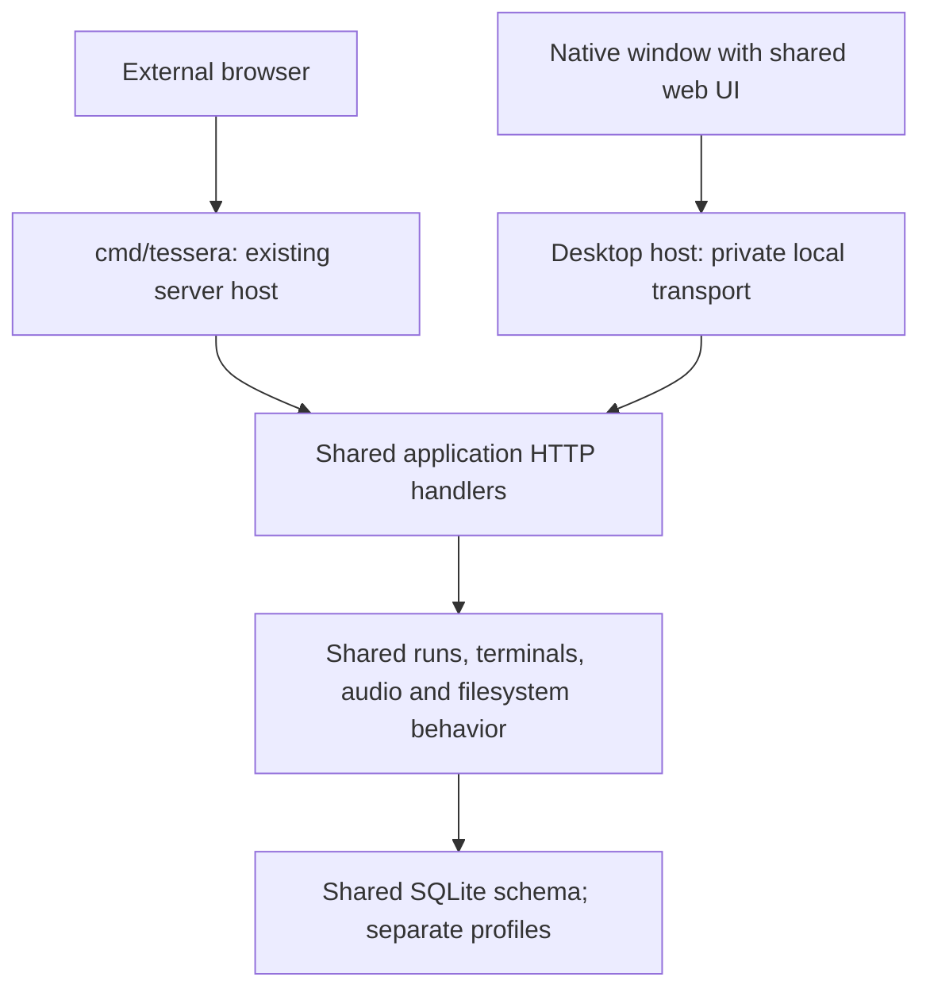

# Native desktop build proposal

Status: original exploration, followed by implementation on 2026-09-17. See
[desktop build documentation](native-desktop.md) for current behavior and remaining
macOS validation. The implementation uses Cocoa/WKWebView directly instead of
Wails, a persisted OS-assigned port to preserve localStorage, and an independent
preview workflow. Statements below describe the original proposal, not validation
results.

## Goals and assumptions

Add a native application window around Tessera's existing web UI. The webserver
remains the primary product, build, API, and release path. Share the frontend,
storage schema, command execution, terminal core, and HTTP feature handlers.
Native here means an OS application window containing a webview; it does not
mean replacing Tessera's panes with native widgets.

Confirmed scope: macOS first; private loopback HTTP is acceptable. Windows and
Linux follow only after the macOS transport spike. What failed in the previous
Wails attempt and the minimum macOS version remain open.
No inbound network access to the desktop workspace is allowed. This does not
implicitly disable outgoing VNC/audio connections or networking from user-run
commands. A completely offline or network-sandboxed application is separate scope.

## Existing seams and constraints

- `cmd/tessera/main.go` owns server flags, tray integration, updates, and restart.
- `internal/server/server.go` constructs managers, opens SQLite, starts listeners,
  and shuts resources down. It already accepts `127.0.0.1:0`.
- `internal/app/app.go` constructs a reusable `http.Handler`.
- `internal/desktop/` currently provides server controls and browser launching,
  not an embedded GUI. No Wails dependency/configuration was found in the current
  tree; the cause of the earlier attempt's failure remains unknown.
- `web/` already embeds the UI, fonts, and bundled JavaScript. No frontend rewrite
  or new frontend framework is needed.
- Terminal and VNC use WebSockets; worksheet output streams NDJSON; audio uses
  SSE and streamed/ranged media. Browser panes proxy pages and hot-reload sockets.
  These are the deciding compatibility tests, not whether the home screen loads.
- Startup reads saved Local HTTPS settings and can open another listener.
  A loopback HTTP address alone is therefore insufficient for desktop isolation.
- The updater selects `tessera-<os>-<arch>` assets. Reusing it unchanged could
  replace a desktop executable with the server executable.
- The default database lives under the user's `Tessera` configuration directory.
  A desktop build needs a distinct default database/profile.

## Approach comparison

| Approach | Sharing | Main cost | Assessment |
| --- | --- | --- | --- |
| Native webview loading private loopback HTTP | Existing UI and HTTP transports remain usable | Local session protection and webview compatibility | Selected direction |
| Wails asset handler plus native streams, no TCP listener | Same UI and managers; transport adapters required | Streaming, redirects, media, and Browser/VNC adaptation | Use only if zero listeners is required |
| Rewrite UI in a native widget toolkit | Backend concepts only | Rebuild panes, editors, terminal rendering, interactions | Poor fit for keeping the webserver primary |

Wails remains a candidate, not a prerequisite. Evaluate a pinned Wails v3 release
as a thin window host. Its documentation currently describes v3 as beta and
supports URL navigation. Do not migrate the existing server to Wails' server mode.
If URL hosting, privilege isolation, or streaming fails the spike, evaluate another
thin webview host against the same tests before changing Tessera's protocols.

Wails v2's asset handler is not a drop-in network server: its documented matrix
excludes WebSockets on all platforms and response streaming on Windows. This is
a plausible obstacle for Tessera, not a diagnosis of the earlier attempt.
The v3 changelog describes socket-free Streams, but availability in the pinned
release and behavior must be verified. A WebSocket-shaped API does not automatically
replace Gorilla's HTTP upgrade handlers, media URLs, or proxied page WebSockets.

## Proposed boundaries

Keep Wails imports and platform packaging under a desktop-only entry point,
provisionally `cmd/tessera-desktop/`, and `internal/nativeapp/`. Use an explicit
`desktop` build tag so ordinary `go test ./...` and server builds do not compile
GUI packages or require new GUI libraries. Shared packages must not import Wails.
A separate Go module is a fallback if tagged dependency isolation proves inadequate,
not an initial requirement. Keep the existing tray controller serving its current role.

For the loopback approach, extend server startup only with the concrete policy
and middleware hooks needed by the native host. Avoid a broad lifecycle refactor.
For zero listeners, first extract manager/store creation and cleanup from listener
creation into a small shared runtime. Adapt individual transports at their boundary;
do not create a duplicate business API made of Wails bindings.

## Desktop isolation and behavior

1. Own one private loopback listener on an OS-assigned port. Reject non-loopback
   addresses; expose no address/proxy configuration flags. Bypass persisted Local
   HTTPS startup and reject its configuration/enrollment routes server-side.
2. Require a fresh per-launch session capability for all workspace routes,
   including streams, downloads, proxies, and WebSocket upgrades. Validate the
   exact Host and permitted Origin; retain request-forgery defenses. An origin-less
   client must not bypass the capability check. Loopback alone is not authentication.
3. Prove session bootstrap in the spike: initialize an isolated webview profile
   through native cookie support or a one-use bootstrap mechanism, then remove the
   bootstrap credential from navigation state. Do not store secrets in logs or
   persistent URLs. Cookies on localhost are not port-scoped; do not rely on a
   cookie alone when visiting other local services. Choose and test credential
   scoping for Browser panes and proxy paths before declaring this safe.
4. Restrict top-level navigation to Tessera. Open external links through the OS
   browser. Keep Browser panes sandboxed; arbitrary page content must never gain
   native bindings or desktop credentials. Do not inject a privileged bridge into
   untrusted frames. Preserve existing CSP rather than broadly weakening it.
5. Use a distinct database and webview profile. Share schemas, not a live database
   between server and desktop processes. Later import should copy a consistent
   database snapshot and address roster/session ownership explicitly.
6. Preserve client preferences across restarts. Random ports change localStorage
   origins: migrate desktop-local preferences to an explicit profile store or
   prove a stable-origin arrangement. Do not silently lose performance or audio
   preferences each launch.
7. Single application instance per desktop profile; a second launch focuses the
   existing window. Close saves pending workspace state and terminates managed
   runs, PTYs, audio and connections before closing storage. Unsaved editor data
   follows an explicit close-confirmation policy. No background host by default.
8. Desktop capabilities hide server setup and updater controls; backend policy
   enforces the same restrictions. Keep general workspace behavior shared.
   Start with `Updater: nil`; supply optional audio companions manually and explain
   their absence. Disabling the updater also disables automatic encoder retrieval.

This protects against ordinary network/browser access, not hostile software with
the same OS account's full privileges. User-launched programs can themselves open
ports; preventing that would require an OS sandbox outside this proposal.

## Incremental implementation plan

### 1. Time-boxed feasibility spike

Use an isolated macOS prototype and one pinned toolkit version. Start the current UI in
a native window against a private ephemeral listener. Establish protected session
bootstrap before enabling host-control routes. Test on macOS:

- Terminal input, resize, reconnect, Sixel, large output and keyboard shortcuts.
- Worksheet incremental output and cancellation without buffering until completion.
- Audio SSE, range seeking, playback policy and stream cancellation.
- Upload/download, save dialogs, clipboard, paste events, IME and drag/drop.
- Browser pane redirects, sandbox behavior and hot-reload WebSockets; VNC framing.
- Startup errors, close with active work, relaunch and preference persistence.
- Credential isolation from external pages, frames, other local ports and logs.

Prioritize WKWebView canvas/WASM behavior, Retina performance, Command-key copy
and paste, macOS application menus, Dock activation, and the native main-thread
event loop. Verify launch from Finder supplies a useful shell environment and
working directory, since it may differ from a terminal launch. Use a macOS runner
and real interactive Mac for validation; the current Windows workspace cannot
establish macOS GUI compatibility. Confirm Apple Silicon versus Intel coverage
and minimum OS before selecting the packaging matrix.

Deliver a compatibility table, observed failures, and the selected transport.
Reject a toolkit that requires extensive shared-frontend changes. If zero listeners
is selected, replace this spike's transport with asset-handler/native-stream adapters
and require proof of all streaming cases before proceeding.

### 2. Minimal shared policy changes

Add explicit desktop listener/admin policy, session middleware, and a small runtime
capability response consumed by the shared UI. Default behavior stays server mode.
For the loopback path, retain existing HTTP payloads and stream formats. Test that
saved HTTPS settings cannot expose the desktop and server configuration still works.

### 3. Native lifecycle and profile

Implement the tagged desktop entry point, native window, profile persistence,
single-instance behavior, graceful quit and visible startup failure reporting.
Keep clipboard/dialog adapters small and provide browser defaults to shared code.
Use native OS chrome initially; custom title bars and tray behavior can follow.

### 4. Separate packaging and release

Create a desktop workflow with distinct `tessera-desktop-*` assets. Desktop build
failures must not block the existing server release. Reuse the frontend build and
terminal-core verification; do not alter server asset names or installer behavior.
Windows needs WebView2 runtime handling; macOS needs an app bundle/signing plan;
Linux needs a documented WebKit/GTK runtime baseline. A native executable is not
necessarily dependency-free. Verify installation without a development toolchain.
Add desktop-specific updates only after artifact selection and restart semantics
are designed; manual installation is sufficient for the first preview.

### 5. Acceptance gate

Run existing Go and frontend suites and the existing server build matrix. Add
focused tests for desktop policy, capability rejection, startup/quit cleanup and
profile persistence. Inspect actual listeners and attempt access from another
machine; also reject unauthenticated local clients and hostile Host/Origin values.
Exercise the real webview on each claimed platform, including sleep/resume and
high-DPI rendering. Compare terminal responsiveness and memory against the browser
on the same workload. Do not claim cross-platform support from a Windows-only spike.

## Decisions still open

- Minimum macOS version and Apple Silicon/Intel coverage (macOS first is confirmed).
- Details or artifacts from the previous Wails attempt.
- Whether outgoing VNC/audio features should remain in the desktop UI.

## Primary references

Checked 2026-09-17; recheck and pin versions before implementation.

- [Wails v2 asset-server feature matrix](https://v2.wails.io/docs/reference/options/)
- [Wails v3 status](https://v3.wails.io/)
- [Wails v3 window URL navigation](https://v3.wails.io/reference/window/)
- [Wails v3 changelog, including Streams](https://v3.wails.io/changelog/)
- [Wails v3 platform dependencies](https://v3.wails.io/getting-started/installation/)
